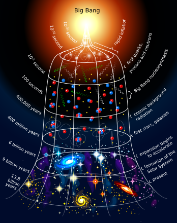
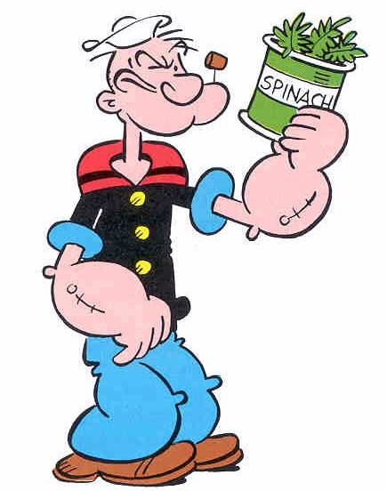

# **PKI Foundations for Security Pros**

## Jake Hildreth
## [jakehildreth.com](https://jakehildreth.com/)

Anti-Cast, 2025-11-12

---

# `Get-ADUser -Identity ‘Jake Hildreth’`
- Husband, Dad, Recovering Sysadmin
* Principal Security Consultant @ Semperis
* Open-source Toolmaker:
Locksmith, BlueTuxedo, PowerPUG!
* Microsoft MVP:
PowerShell + Identity & Access

---

# Agenda

* History & Goals
* Encoding vs. Encryption
* Symmetric Encryption
* Asymmetric Encryption
* Hashing Functions

* Signing
* Certificates
* Public Key Infrastructute (PKI)
* Real-World Uses

---
<!-- _class: lead -->
# **History**
In the beginning was the word...

---

# **History**
In the beginning was the **pass**word...

---

## Antiquity
* 1900 BCE: Non-Standard Hieroglyphs
* 1500 BCE: Clay Tablets
* 600 BCE: Hebrew Scholars
* 400 BCE: Polybius Square
* 300 BCE: Kama Sutra
* 75 BCE: Caesar

## Medieval
* 750-800 CE: Arabic Scholars
* 800-1100 CE: English Scribes
* 1400 CE: Arabic Scholars
* 1508 CE: Tabula Recta
* 1626 CE: Antoine Rossignol

--- 

## Pre-WWII
* Focus on Cryptanalysis
* Many Medieval Systems Broken
* First Cryptographic Machines
* First One Time Pad

## WWII
* Allies:
  - TypeX, SIGABA, Lacida
* Axis:
  - Enigma, Purple, SG-41

---

## Modernity

* Claude Shannon
* Data Encryption Standard (DES)
* Diffie-Hellman (DH)
* Rivest, Shamir, Adelman (RSA)
* Message Digest Algorithms (MD*)

* Digital Signature Algorithm (DSA)
* Secure Hash Algorithms (SHA)
* Elliptic Curve Cryptography (ECC)
* Advanced Encryption Standard (AES)
* Post-Quantum Cryptography (PQC)

---
<!-- _class: lead -->

# **Goals of Cryptography**

--- 

# Confidentiality
### Ensures a message is only readable by its intended recipient.

---

# Integrity
### Ensures a message has not been tampered with or changed.

---

# Non-Repudiation
### Ensures an author cannot refute authorship of a message.

---

# Authentication
### Provides proof an author of a message is who they claim.

---
<!-- _class: lead -->
# **Encoding vs. Encryption**
It's all about intention

---

# Encoding
- Not intended to remain secret
* that is, no **Confidentiality**

# Common Schemes
- ASCII
- UTF-8/16/32
- Braille
- Morse Code
- Base64

---

# Example: Cetacean Cipher
- "Hello, Anti-Cast!" encoded:
* EEEEEEEEEeEEeEEEEEEEEEEEEeeEEeEeEEEEEEEEEeeEeeEEEEEEEEEEEeeEeeEEEEEEEEEEEeeEeeeeEEEEEEEEEEeEeeEE EEEEEEEEEeEEEEEeEEEEEEEEEeeEeeeEEEEEEEEEEeeeEeEEEEEEEEEEEeeEeEEeEEEEEEEEEEeEeeEeEEEEEEEEEeEEEEeeEEEEEEEEEeeEEEEeEEEEEEEEEeeeEEeeEEEEEEEEEeeeEeEEEEEEEEEEEEeEEEEe
Try it yourself: https://www.a.tools/Tool.php?Id=389
---

# Encryption
- Intended to remain secret
* Yes! **Confidentiality**
* Requires 1 or more "keys"
* Keys are just **really** big numbers

# Common Schemes
- Symmetric - 1 key
  - DES
  - AES
- Asymmetric - 2+ keys
  - RSA
  - ECC

---

---
<!-- _class: lead -->
# **Symmetric Encryption**
Pretty much all cryptography before the 1970s

---

# Symmetric Encryption

## Pros
* Same key to encrypt/decrypt message
= Easy to understand
* Simple algorithms
= Very fast

## Cons
* Keys must be shared via a secure channel before communication
= Difficult!
* One key per communication group
= Key management becomes untenable
* Does not protect Integrity, ensure Non-repudiation, provide Authentication
= Limited Use

---
<!-- _class: lead -->
# **Example: ROT13**
Hello, Anti-Cast!

ROT13
Uryyb, Nagv-Pnfg!
ROT13

Hello, Anti-Cast!

---
<!-- _class: lead -->
# **Asymmetric Encryption**
The enabler of the modern internet

---

# Asymmetric Encryption

## Pros
* One **key pair** per identity
= Easy to manage
* Public keys can be shared over insecure channel
= Much easier than secure channel
* Provides Confidentiality, Integrity, Non-repudiation & Authentication
= Secure communications over insecure networks

## Cons
* Complicated algorithms
= Not fast

---

<!-- _class: lead -->
# **Example: ROT7 + ROT19**
Hello, Anti-Cast!

ROT7
Olssv, Huap-Jhza!
ROT19

Hello, Anti-Cast!

--- 

<!-- _class: lead -->
# **Hash Functions**
Subheading TBD

---

# Hash Functions

- Maps any data to a (probably) unique fixed-length value
- Can't be easily reversed
- Ensures Integrity
* HELLOANTICAST
  - 8+5+12+12+15+1+14+
  20+9+3+1+19+20
  - Hash: 0139

| Letter | Number | Letter | Number |
|-|-|-|-|
| H | 8 | N | 14 |
| E | 5 | T | 20 |
| L | 12 | I | 9 |
| O | 15 | C | 3 |
| A | 1 | S | 19 |

Note: this is a terrible hash function. Do not use this for anything.

<!--
Max letter = 38
-->

---

<!-- _class: lead -->
# **Signing**
Subheading TBD

---

<!-- _class: lead -->
# **Certificates**
Subheading TBD

---

<!-- _class: lead -->
# **PKI**
Subheading TBD

---

<!-- _class: lead -->
# **Real-World Uses**
Subheading TBD

---

